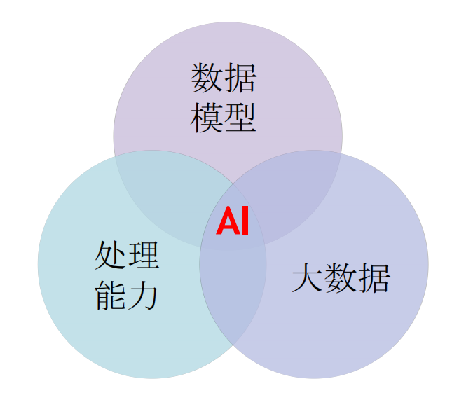
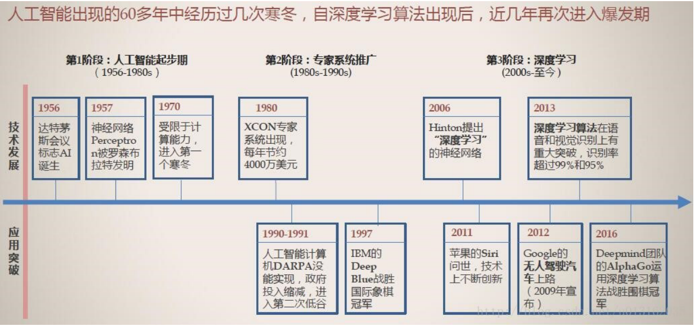
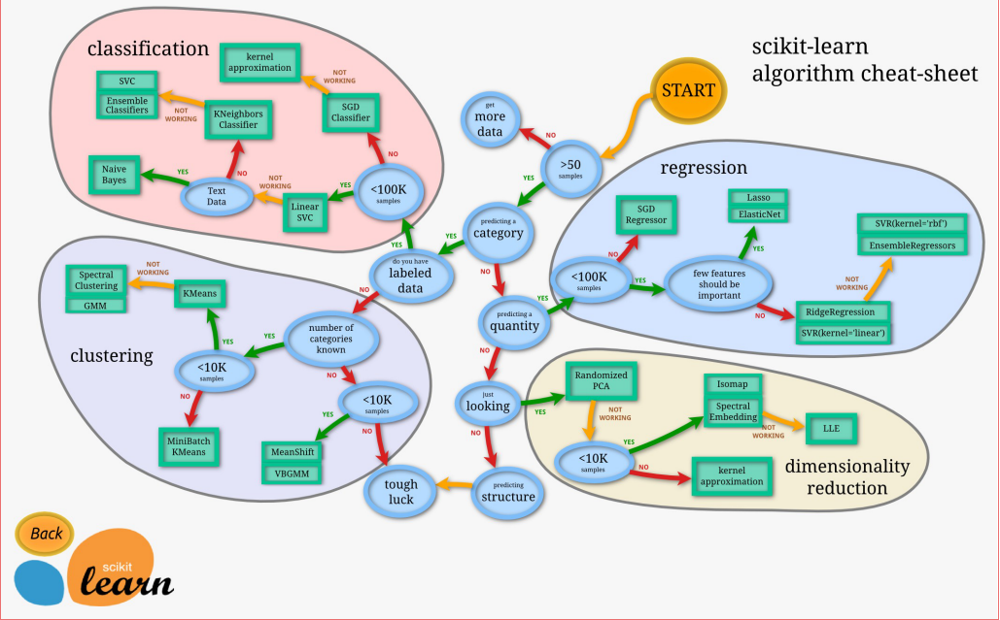

# 1. 人工智能-总览,应用,前沿
+ 1.1 项目背景
  + (1) 人工智能简介
  + (2) 人工智能应用场景
  + (3) 人工智能技术概览
  + (4) 机器学习算法
  + (5) 主流机器学习库和计算框架介绍
  + (6) 如何进行机器学习
***
# 2. 人工智能简介
+ 2.1 人工智能核心点
  + 
  ***
+ 2.2 计算能力的提升加速人工智能的发展  
略
+ 2.3 大数据的理解与分析需要AI  
略
+ 2.4 人工智能主要发展阶段  
 + 
  ***
# 3. 人工智能应用场景
+ 3.1 智能客服& 助手  
略
+ 3.2 图像识别-同款商品推荐  
略
+ 3.3 实时视频分析：交通拥堵预测  
略
+ 3.4 个性化推荐：千人千面的电商  
略
+ 3.5 征信  
略
***
# 4. 机器学习算法(重点)
+ 4.1 scikit-learn algorithm cheat-sheet
  + 
+ 4.2 分类和回归算法
  + 预测任务，根据其他属性的值，预测特定属性的值。
  + 分类属于预测任务，就是通过已有数据集（训练集）的学习，  
  得到一个目标函数f（模型），把每个属性集x映射到目标属性y（类），  
  且y必须是离散的（若y为连续的，则属于回归算法）。
  + KNN (不属于机器学习,他没有学习的过程)  
  决策树，随机森林，GBDT
    + K最近邻，就是k个最近的邻居的意思，说的是每个样本都可  
    以用它最接近的k个邻居来代表。
    + 算法流程：
    + 1、计算已知类别数据集中的点与当前之间的距离
    + 2、按照距离递增次序排序
    + 3、选取与当前点距离最小的k个点
    + 4、确定前k个点所在的类别的出现频率
    + 5、返回前k个点出现频率最高的类别作为当前点的预测分
类
  + SVM  
  Linear Regression, Logistic Regression