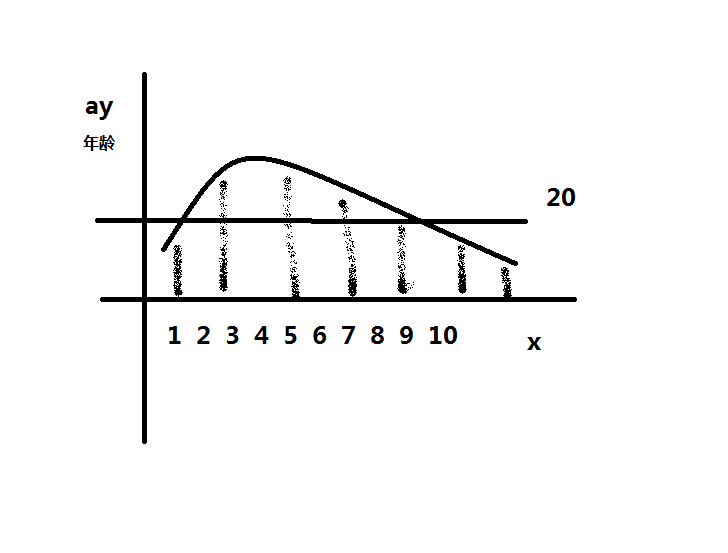
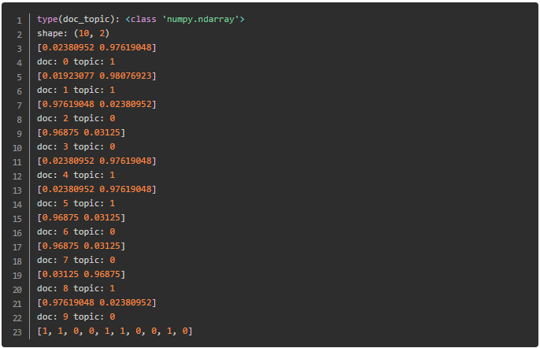
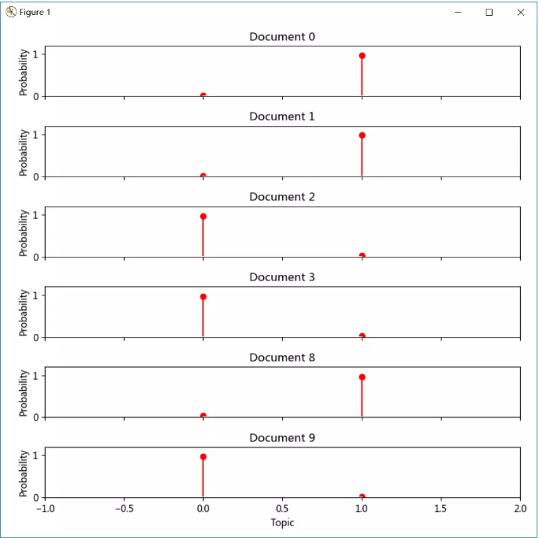
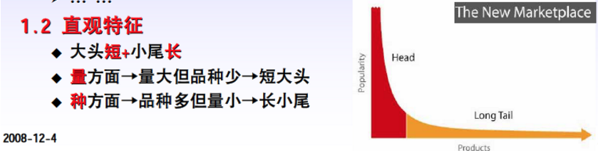

# 1. 人工智能概念
- 1.1 人工智能 包含 机器学习 包含 深度学习
  + 机器学习
  + 例子:识别身份证-->(弱人工智能)识别身份证号 310xxxxxxxxxx 训练如何识别图片中的身份证号码的识别器(图)
  + 
  + 深度学习(识别器的一种方式)
  + 神经网络:结构很深很复杂的时候称为深度学习
- 1.2 模式识别
  + 以身份证为例,某一个区域的某一个坐标来作为特征,分割,从图片中提取有用的数据特征
  + 做成一个向量样本,在进行训练
- 1.3 预测任务
  + 身份证识别出身份证号,也是属于预测任务
  + 已知的一张身份证的图片,需要获取我需要的未知信息,身份证号
	也算是一种预测任务
---
- 1.5 推荐算法
  + 基于内容的推荐
	根据人的某些历史数据(购买记录,聊天记录等)
	来推测出推荐给特定人群的信息
  + 例子:今日头条的新闻推送,会根据用户浏览过的新闻来推荐
- 1.6分布式
  + 数据量大了之后,将数据库(程序,算例) 分开到各个拆开的节点上来进行计算存储等
  + 逻辑:
    + 单机计算:通过map操作,本地将数据过滤(filter),转换等等简单的操作数据
    + 跨节点通信:聚合(reduce)操作,例:算所有数据的条目:本地的各个map数据分别统计之后进行全局的sum操作(图)
  + 
- 1.7容错性
	+ 分布式的节点可能会有宕机/磁盘坏了等丢失节点的时候,还能保证其他的节点还能进行运算,正常运行.
	+ 就代表系统能够有容错性
	+ 例:redis的缓存服务器
- 1.8协同过滤
	+ 结合推荐算法的例子
	    + 基于用户之间的共同兴趣的推荐
	    + 例:A,B在今日头条上都曾看过差不多相同的新闻,则今日头条以后也会将A看过的新闻来推荐给B,用户之间的共同兴趣的推荐(图)
        + 
# 2.获取数据与特征工程
- 2.1 数据集,训练集,测试集,验证集
	+ 训练过程:输入样本数据 (图),目的是做出一个分类器(机器学习是学习如何做分类器和使用分类器)
	+ 预测过程:根据训练过程的输出来进行预测,和训练相辅相成
      + 案例:y=ax 是个函数
      + x:代表人的属性,y:年龄属性
      + 已知用户的真实年龄,需要推测出准确的a参数
      + 减少误差的方式,枚举a.例如a≈100000->100000
      + 循环遍历,找到最优化最精确的a参数
	+ 数据集:(x,y)的数据样本(存储值),元数据
	+ 训练集:拿数据集用于找a参数的过程称为训练集,y=ax函数
	+ 测试集:已经找到过滤(filter)出来的a参数,这时候需要来测试这个分类器的效果的过程
	+ 验证集:属于训练集和测试集折中,用于防止已知数据准确,但是未知数据效果不好的情况
- 2.2 离散数据,连续数据
	+ 离散数据:
    	+ 例如年龄,30-32岁,数据集(30,31,32).但是不能再继续细化下去的数据称为离散数据
	+ 连续数据:
    	+ 例如体重,只要进度足够,体重的精度可以细化到无限的数据
- 2.3 特征,特征向量,样本,类标签(结合2.1的案例)
	+ 特征:人属性x中的属性身高,体重...都是属于特征
	+ 特征向量:把所有的特征属性组成数排列在一起的向量,身高,体重的排列就是一个二维向量
	+ 样本:例:人属性有小王,小张.那就是等于有2个样本.样本集合
	+ 类标签:年龄--就是类标签,预测的属性的说明
		
- 2.4 递归,迭代,并行
	+ 递归:例:二分查找(图).java中就是自己调用自己比如xml标签读取
		+ 树形搜索
		+ 
	+ 迭代:
    	+ for循环
    	+ 比如轮询,如下数数,0-100
         ```
         ##0-100的轮询数数
         def countNum():
            for it range in 100:
                x=0
                print("第{}次轮询的数字为{}".format(x,x))
            return x
         ```
	+ 并行:
        + 多线程,函数分成多个线程同时去做
- 2.5 字段
    + 相当于2.1的案例中人属性的列(体重,身高...)
    + 有点类似数据库中(SQL)字段的意思
- 2.6 PCA,降维
    + 降维:将高维数据降低为低维数据
    + PCA:降维的一种方法(算法)
        + 例如 人属性(身高,体重,肤色),这个数据是有3个维度
        + 通过映射(PCA)算法数据变成($x_1,x_2$)这种二维数据
        + PS:这个二维数据是三维数据通过PCA的算法把数据维度降低,当然直接将三维数据中的标签
        __"肤色"__
        直接删除也是一种降维
- 2.7 分布,主题分布,长尾分布
	+ 分布: 帮助描述数据特性的方式,以2.1的案例为例
	+ 
	+ 横轴是代表每一个人,纵轴是代表年龄段,画的直线统计的是20岁这个年龄段的正太分布
    ---
    + 主题分布:横轴是word(字段)或者doc(文档),用于看整体状态的,以下为主题分布的案例
    + 案例 1
      + 
        ```
        总共有10篇文档，分为两个主题。
        每个doc_topic[i]中包含了两个值，一个是主题0的概率，一个是主题1的概率。哪个概率大说明这个文档的主题是哪个。
        最终10篇文章分别对应于主题1, 1, 0, 0, 1, 1, 0, 0, 1, 0
        ```
      + 
    ---
    + 长尾分布:
      + 形状如下图,头重脚轻
      +  
    ---
    + PS:分布还有其他的形式:正态分布,指数分布等等
- 2.8 矢量,标量
	+ 矢量
      + 向量,如(1,2),这种二维向量也称作矢量
	+ 标量
      + 常见的数,如1,2,10等等 
    + 区别:矢量是带方向的
- 2.9 多项式
    + 标量配合四则运算构造出来的一个式子
      + 例:$(x+1)^2$  ==>  多项式
- 2.10 归一化
    + 将数据的差异化统一权衡成一种数据
      + 例:2.1案例:人属性身高,体重.可以将这两个属性映射成身高与体重的比例
      + 比如可以用这个公式(身高cm－体重kg)×70﹪ 得出的比率来表达数值,将差异化的值归一化,也是一种降维操作
      + 防止某个属性对后面的操作影响特别大
- 2.11 人工标注
    + 1.1 见案例身份证识别案例
      + 识别出身份证号然后录入系统,没标签的身份证图片转换成识别出来之后带有标签的身份证图片的过程称为人工标注
- 2.12 特征选择
    + 引用2.1案例,体重,身高,肤色
    + 选特征,例如肤色对于预测用处不大,则删除肤色这个特征,作用也是减少特征的选择,有利于减少训练模型的复杂度
- 2.13 正例样本,负例样本
    + 二分类的一个过程
      + 比如:检测进程服务的状态,首先判断服务是否启动,启动的则判定为正例样本,未启动的判定为负例样本
- 2.14 类别集合,待分类项
    + 类别集合:案例2.13 服务启动和未启动的一种分类就是一种类别集合
    + 待分类项:案例2.1 预测人年龄的分类器已有,此时又有一段身高体重的数据来进入
      + 需要操作数据将其输入样本的分类器之后预测年龄,这些没有label(标签)的新进来的身高体重数据就是待分类项
- 2.15 序列,向量序列
    + 序列:一组数,比如(1,3,3,5)顺序不可调整的一组数称为序列
    + 向量序列:((80,160),(90,180),(100,190),(60,155)),同序列的概念,只是里面的数(标量)变成向量(矢量)
- 2.16 自变量,因变量
    + 以2.1的案例为例
      + $y=ax$
      + y:年龄(因变量)
      + x:身高体重...(自变量)
      + a:学习的参数
- 2.17 采样
    + 假如有10000人来做样本,随机从中选取100人来进行的过程就是采样
- 2.18 分词,分词器
    + 文本中分词
      + 例如:"高位数据投影到低维空间"
      + 将句子切成需要的词,|高位数据|投影|到|低维|空间
- 2.19 高位数据投影到低维空间
    + 引用2.1的案例,将身高体重肤色映射到坐标空间上(图)
    + 
- 2.20 特征提取
    + 从三个特征中提取出两个有用特征称为特征提取
      + 例:身高,体重,肤色,提取出体重,肤色两个特征的过程称为特征提取
- 2.21 近似
    + 举例:用户体重为120.2公斤
      + 近似取其体重为120公斤,核心的用处是加快运算时间,减少数据占用的空间
---
# 3.模型训练