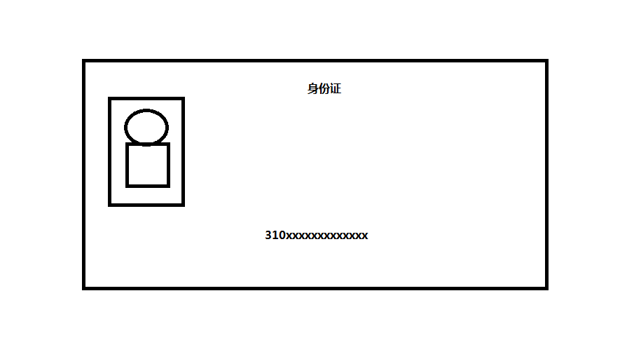
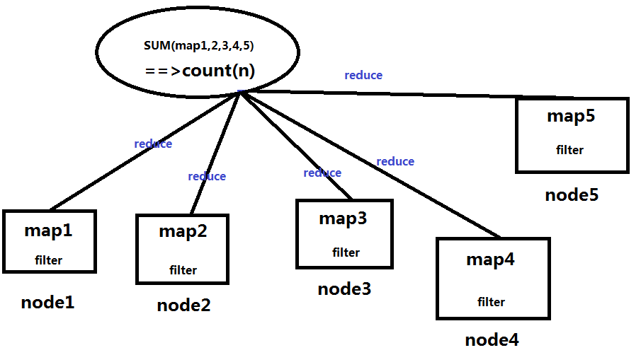
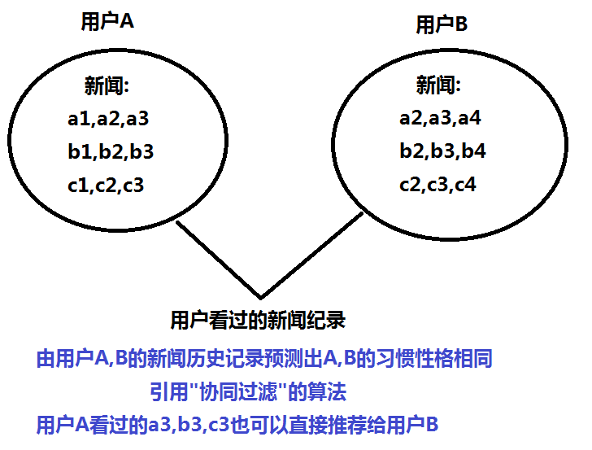

# 1. 人工智能概念
- 1.1 人工智能 包含 机器学习 包含 深度学习
  + 机器学习
  + 例子:识别身份证-->(弱人工智能)识别身份证号 310xxxxxxxxxx 训练如何识别图片中的身份证号码的识别器(图)
  + 
  + 深度学习(识别器的一种方式)
  + 神经网络:结构很深很复杂的时候称为深度学习
- 1.2 模式识别
  + 以身份证为例,某一个区域的某一个坐标来作为特征,分割,从图片中提取有用的数据特征
  + 做成一个向量样本,在进行训练
- 1.3 预测任务
  + 身份证识别出身份证号,也是属于预测任务
  + 已知的一张身份证的图片,需要获取我需要的未知信息,身份证号
	也算是一种预测任务
---
- 1.5 推荐算法
  + 基于内容的推荐
	根据人的某些历史数据(购买记录,聊天记录等)
	来推测出推荐给特定人群的信息
  + 例子:今日头条的新闻推送,会根据用户浏览过的新闻来推荐
- 1.6分布式
  + 数据量大了之后,将数据库(程序,算例) 分开到各个拆开的节点上来进行计算存储等
  + 逻辑:
    + 单机计算:通过map操作,本地将数据过滤(filter),转换等等简单的操作数据
    + 跨节点通信:聚合(reduce)操作,例:算所有数据的条目:本地的各个map数据分别统计之后进行全局的sum操作(图)
  + 
- 1.7容错性
	+ 分布式的节点可能会有宕机/磁盘坏了等丢失节点的时候,还能保证其他的节点还能进行运算,正常运行.
	+ 就代表系统能够有容错性
	+ 例:redis的缓存服务器
- 1.8协同过滤
	+ 结合推荐算法的例子
	    + 基于用户之间的共同兴趣的推荐
	    + 例:A,B在今日头条上都曾看过差不多相同的新闻,则今日头条以后也会将A看过的新闻来推荐给B,用户之间的共同兴趣的推荐(图)
        + 
# 2.获取数据与特征工程
- 2.1 数据集,训练集,测试集,验证集
	+ 训练过程:输入样本数据 (图),目的是做出一个分类器(机器学习是学习如何做分类器和使用分类器)
	+ 预测过程:根据训练过程的输出来进行预测,和训练相辅相成
	+ 例子:y=ax a是未知
	+ 人的属性x,y年龄的属性
	+ 已知用户的真实年龄,求
# 3.模型训练