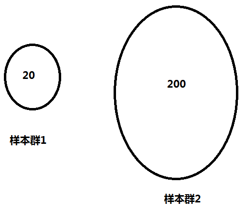
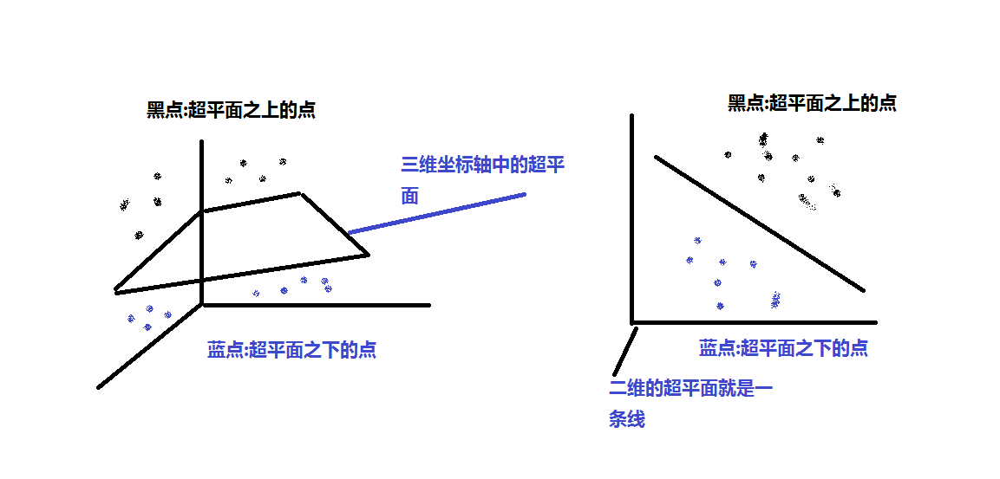
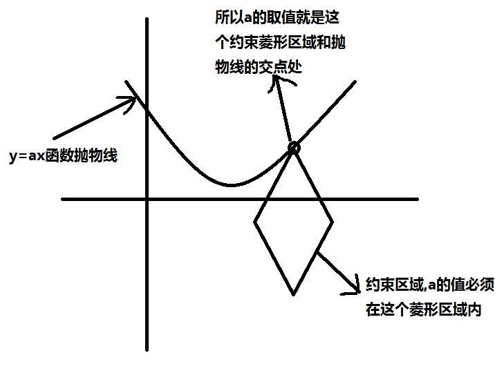
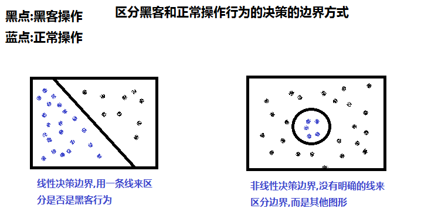
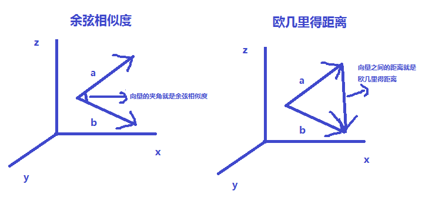

# 1. 人工智能概念
- 1.1 人工智能 包含 机器学习 包含 深度学习
  + 机器学习
  + 例子:识别身份证-->(弱人工智能)识别身份证号 310xxxxxxxxxx 训练如何识别图片中的身份证号码的识别器(图)
  + 
  + 深度学习(识别器的一种方式)
  + 神经网络:结构很深很复杂的时候称为深度学习
- 1.2 模式识别
  + 以身份证为例,某一个区域的某一个坐标来作为特征,分割,从图片中提取有用的数据特征
  + 做成一个向量样本,在进行训练
- 1.3 预测任务
  + 身份证识别出身份证号,也是属于预测任务
  + 已知的一张身份证的图片,需要获取我需要的未知信息,身份证号
	也算是一种预测任务
---
- 1.5 推荐算法
  + 基于内容的推荐
	根据人的某些历史数据(购买记录,聊天记录等)
	来推测出推荐给特定人群的信息
  + 例子:今日头条的新闻推送,会根据用户浏览过的新闻来推荐
- 1.6分布式
  + 数据量大了之后,将数据库(程序,算例) 分开到各个拆开的节点上来进行计算存储等
  + 逻辑:
    + 单机计算:通过map操作,本地将数据过滤(filter),转换等等简单的操作数据
    + 跨节点通信:聚合(reduce)操作,例:算所有数据的条目:本地的各个map数据分别统计之后进行全局的sum操作(图)
  + 
- 1.7容错性
	+ 分布式的节点可能会有宕机/磁盘坏了等丢失节点的时候,还能保证其他的节点还能进行运算,正常运行.
	+ 就代表系统能够有容错性
	+ 例:redis的缓存服务器
- 1.8协同过滤
	+ 结合推荐算法的例子
	    + 基于用户之间的共同兴趣的推荐
	    + 例:A,B在今日头条上都曾看过差不多相同的新闻,则今日头条以后也会将A看过的新闻来推荐给B,用户之间的共同兴趣的推荐(图)
        + 
# 2.获取数据与特征工程
- 2.1 数据集,训练集,测试集,验证集
	+ 训练过程:输入样本数据 (图),目的是做出一个分类器(机器学习是学习如何做分类器和使用分类器)
	+ 预测过程:根据训练过程的输出来进行预测,和训练相辅相成
      + 案例:y=ax 是个函数
      + x:代表人的属性,y:年龄属性
      + 已知用户的真实年龄,需要推测出准确的a参数
      + 减少误差的方式,枚举a.例如a≈100000->100000
      + 循环遍历,找到最优化最精确的a参数
	+ 数据集:(x,y)的数据样本(存储值),元数据
	+ 训练集:拿数据集用于找a参数的过程称为训练集,y=ax函数
	+ 测试集:已经找到过滤(filter)出来的a参数,这时候需要来测试这个分类器的效果的过程
	+ 验证集:属于训练集和测试集折中,用于防止已知数据准确,但是未知数据效果不好的情况
- 2.2 离散数据,连续数据
	+ 离散数据:
    	+ 例如年龄,30-32岁,数据集(30,31,32).但是不能再继续细化下去的数据称为离散数据
	+ 连续数据:
    	+ 例如体重,只要进度足够,体重的精度可以细化到无限的数据
- 2.3 特征,特征向量,样本,类标签(结合2.1的案例)
	+ 特征:人属性x中的属性身高,体重...都是属于特征
	+ 特征向量:把所有的特征属性组成数排列在一起的向量,身高,体重的排列就是一个二维向量
	+ 样本:例:人属性有小王,小张.那就是等于有2个样本.样本集合
	+ 类标签:年龄--就是类标签,预测的属性的说明
		
- 2.4 递归,迭代,并行
	+ 递归:例:二分查找(图).java中就是自己调用自己比如xml标签读取
		+ 树形搜索
		+ 
	+ 迭代:
    	+ for循环
    	+ 比如轮询,如下数数,0-100
         ```
         ##0-100的轮询数数
         def countNum():
            for it range in 100:
                x=0
                print("第{}次轮询的数字为{}".format(x,x))
            return x
         ```
	+ 并行:
        + 多线程,函数分成多个线程同时去做
- 2.5 字段
    + 相当于2.1的案例中人属性的列(体重,身高...)
    + 有点类似数据库中(SQL)字段的意思
- 2.6 PCA,降维
    + 降维:将高维数据降低为低维数据
    + PCA:降维的一种方法(算法)
        + 例如 人属性(身高,体重,肤色),这个数据是有3个维度
        + 通过映射(PCA)算法数据变成($x_1,x_2$)这种二维数据
        + PS:这个二维数据是三维数据通过PCA的算法把数据维度降低,当然直接将三维数据中的标签
        __"肤色"__
        直接删除也是一种降维
- 2.7 分布,主题分布,长尾分布
	+ 分布: 帮助描述数据特性的方式,以2.1的案例为例
	+ 
	+ 横轴是代表每一个人,纵轴是代表年龄段,画的直线统计的是20岁这个年龄段的正太分布
    ---
    + 主题分布:横轴是word(字段)或者doc(文档),用于看整体状态的,以下为主题分布的案例
    + 案例 1
      + 
        ```
        总共有10篇文档，分为两个主题。
        每个doc_topic[i]中包含了两个值，一个是主题0的概率，一个是主题1的概率。哪个概率大说明这个文档的主题是哪个。
        最终10篇文章分别对应于主题1, 1, 0, 0, 1, 1, 0, 0, 1, 0
        ```
      + 
    ---
    + 长尾分布:
      + 形状如下图,头重脚轻
      +  
    ---
    + PS:分布还有其他的形式:正态分布,指数分布等等
- 2.8 矢量,标量
	+ 矢量
      + 向量,如(1,2),这种二维向量也称作矢量
	+ 标量
      + 常见的数,如1,2,10等等 
    + 区别:矢量是带方向的
- 2.9 多项式
    + 标量配合四则运算构造出来的一个式子
      + 例:$(x+1)^2$  ==>  多项式
- 2.10 归一化
    + 将数据的差异化统一权衡成一种数据
      + 例:2.1案例:人属性身高,体重.可以将这两个属性映射成身高与体重的比例
      + 比如可以用这个公式(身高cm－体重kg)×70﹪ 得出的比率来表达数值,将差异化的值归一化,也是一种降维操作
      + 防止某个属性对后面的操作影响特别大
- 2.11 人工标注
    + 1.1 见案例身份证识别案例
      + 识别出身份证号然后录入系统,没标签的身份证图片转换成识别出来之后带有标签的身份证图片的过程称为人工标注
- 2.12 特征选择
    + 引用2.1案例,体重,身高,肤色
    + 选特征,例如肤色对于预测用处不大,则删除肤色这个特征,作用也是减少特征的选择,有利于减少训练模型的复杂度
- 2.13 正例样本,负例样本
    + 二分类的一个过程
      + 比如:检测进程服务的状态,首先判断服务是否启动,启动的则判定为正例样本,未启动的判定为负例样本
- 2.14 类别集合,待分类项
    + 类别集合:案例2.13 服务启动和未启动的一种分类就是一种类别集合
    + 待分类项:案例2.1 预测人年龄的分类器已有,此时又有一段身高体重的数据来进入
      + 需要操作数据将其输入样本的分类器之后预测年龄,这些没有label(标签)的新进来的身高体重数据就是待分类项
- 2.15 序列,向量序列
    + 序列:一组数,比如(1,3,3,5)顺序不可调整的一组数称为序列
    + 向量序列:((80,160),(90,180),(100,190),(60,155)),同序列的概念,只是里面的数(标量)变成向量(矢量)
- 2.16 自变量,因变量
    + 以2.1的案例为例
      + $y=ax$
      + y:年龄(因变量)
      + x:身高体重...(自变量)
      + a:学习的参数
- 2.17 采样
    + 假如有10000人来做样本,随机从中选取100人来进行的过程就是采样
- 2.18 分词,分词器
    + 文本中分词
      + 例如:"高位数据投影到低维空间"
      + 将句子切成需要的词,|高位数据|投影|到|低维|空间
- 2.19 高位数据投影到低维空间
    + 引用2.1的案例,将身高体重肤色映射到坐标空间上(图)
    +  
- 2.20 特征提取
    + 从三个特征中提取出两个有用特征称为特征提取
      + 例:身高,体重,肤色,提取出体重,肤色两个特征的过程称为特征提取
- 2.21 近似
    + 举例:用户体重为120.2公斤
      + 近似取其体重为120公斤,核心的用处是加快运算时间,减少数据占用的空间
---
# 3. 模型训练
- 3.1 模型,参数
    + 举例2.1的$y=ax$的人属性案例
    + 这个式子(函数)就是一个预测模型
    + a这个未知的数需要预测的数就是参数
- 3.2 训练,预测,分类,回归,聚类
    + 训练:找到最优参数过程称为训练,以2.1的案例,找到a的过程称为训练
    + 预测:a已知,预测器已经有了.但是输入一些样本(身高体重,没有年龄),这个时候预测这些样本的年龄的过程称为预测
    + 分类:某些样本预测出来的年龄是个标签,假如说20-30岁是一档,31-40是一档,这种判断就是一种分类
    + 回归:如果预测值是体重(连续值)就是一个回归的过程),(训练一个回归器)
      + 回归通常是机器学习中使用的第一个算法。通过学习因变量和自变量之间的关系实现对数据的预测。
      + 例如，对房价估计时，需要确定房屋面积（自变量）与其价格（因变量）之间的关系，可以利用这一关系来预测给定面积的房屋的价格。可以有多个影响因变量的自变量。
      + 因此，回归有两个重要组成部分：自变量和因变量之间的关系，以及不同自变量对因变量影响的强度。
    + 聚类:样本都不知道年龄,但是能根据 身高,体重,肤色 这三个属性能区分出来哪些人属于一类,哪些人属于不同类的,而不需要年龄这个属性
- 3.3 目标函数,损失函数
    + 目标函数:构造的年龄预测器$y=ax$就是一个目标函数(预测函数)
    + 损失函数:评判年龄预测器函数中a参数是否是最优值的函数,例如:构建一个损失函数用来评价上面的构造的目标函数$(y_预-y_真)^2$ 度量参数是否是最优的
- 3.4 属性集X,目标属性Y
    + 属性集X:以2.1的案例来说,身高,体重,肤色这些属性将它们没有顺序的放到一起的集合,就称为属性集
    + 目标属性Y: age,就是所要求的的$y=ax$函数中的y,称为目标属性
- 3.5 梯度,步长
    + 梯度:a的参数移动方向,比如a的移动是从0-1000的方向,这个方向就成为梯度
    + 步长:加入每次a移动的长度为1,循环1000次,打到0-1000的迭代,这个距离长度1就称为步长
- 3.6 全局最优解,局部最优解
    + 如下图,假设最小值就是最优解
    +  
- 3.7 准确度,误差,逼近
    + 准确度:比如:衡量2.1年龄预测器 $(y_真-y_预)^2$的方法
    + 误差:这个值越小,代表这个值的误差越小,这个式子也是求误差的算式,也代表这个这个预测值的准确度越高,也就是越接近3.6图中的最优解的点
    + 逼近:找到全局最优值的过程称为逼近,见3.6的抛物线图从抛物线的某一点找到min值的过程称为逼近
- 3.8 训练速度,解空间搜索
    + 训练速度:如其名,训练速度的快与慢
    + 解空间搜索:和3.7的逼近概念类似,往最优值方向搜索的过程称为解空间搜索
- 3.9 簇,聚类中心
    + 以2.1的年龄案例来说,先不看年龄,只看(身高,体重,肤色)这三个属性.期望将他们分到不同的堆(群体)中,没一个群体代表一个簇(样本群),如图所示
    +  
    + 聚类中心就是每个群体样本的中心点,也就是平均值
- 3.10 收敛
    + 以3.6的抛物线为例,当找到最优值的点之后,这个值不再作更新了,就称为收敛(值之后不再会有变化)
- 3.11 表征学习
    + 在深度学习提出之后提出来的
      + wiki补充:
      + 在特征学习算法出现之前，机器学习研究人员需要利用手动特征工程（manual feature learning）等技术从原始数据的领域知识（domain knowledge）建立特征，然后再部署相关的机器学习算法。虽然手动特征工程对于应用机器学习很有效，但它同时也是很困难、很昂贵、很耗时、并依赖于强大专业知识。特征学习弥补了这一点，它使得机器不仅能学习到数据的特征，并能利用这些特征来完成一个具体的任务。
      + 和预测性学习（Predictive Learning）不同，表征学习的目标不是通过学习原始数据预测某个观察结果，而是学习数据的底层结构（underlying structure），从而可以分析出原始数据的其它特性。表征学习允许计算机学习使用特征的同时，也学习如何提取特征：学习如何学习。在机器学习任务中，输入数据例如图片、视频、语言文字、声音等都是高维且冗余复杂，传统的手动提取特征已变得不切合实际，所以需要借助于优秀的特征学习技术。
- 3.12 非监督学习,监督学习
    + 非监督学习:没有明确的目标,只是把目标分类成簇(聚类问题,见3.9)
    + 监督学习:监督学习就是有明确的目标(标签),例如
  __识别身份证号__
- 3.13 BP神经网络,反向传播
    + BP神经网络:BP-->反向传播的意思,
      + 课外补充:神经网络的概念
      + BP神经网络是一种多层的前馈神经网络，其主要的特点是：信号是前向传播的，而误差是反向传播的。具体来说，对于如下的只含一个隐层的神经网络模型：
      + BP神经网络的过程主要分为两个阶段，
      + 第一阶段是信号的前向传播，从输入层经过隐含层，最后到达输出层；
      + 第二阶段是误差的反向传播，从输出层到隐含层，最后到输入层，依次调节隐含层到输出层的权重和偏置，输入层到隐含层的权重和偏置。
      + 如下图(3层BP神经网络):
      +  

- 3.14 输入层,隐藏层,输出层
    + 见3.13案例
- 3.15 分类器
    + 以2.1的案例来演示$y=ax$这个求最优a的函数就是一个分类器,x是注入样本,y是目标标签
- 3.16 过拟合,欠拟合
    + 过拟合:以2.1的案例函数来说 假如说训练集(见2.1)的效果特别好准确率特别高,但是测试集(见2.1)的表现效果不太好,准确率特别低,这种情况下就代表过拟合
    + 欠拟合:在测试集和训练集上表现都不太好,称为欠拟合(可能要调整模型之类的操作)
- 3.17 样本进行加权,权重
    + 样本进行加权,如下图
    +  
      + 图中,样本群1中只有20个样本,样本群2有200个样本,这个时候2个样本的数量不平衡,不符合预期想要的2个样本群想要相同数量的效果,这个时候就可以适当给样本群1进行加权,假设把他的数量也扩展到200个,以达到2个样本群差不多数量的目的,这个扩展就叫做样本进行加权
    + 权重:权重系数,略
- 3.18 残差
    + 以2.1的案例$y_真-y_预$这个值就叫做残差
- 3.19 真实值,预测值
    + 见2.1
- 3.20 Line search
    + 线性搜索:优化算法,举例:$y=ax$ 这个得到参数a之后,再进行优化 $a_新=a_旧-αa$ 新的a由原来得到的a-(方向*步长),这样一个找最优的过程就称作一个线性搜索
- 3.21 计算瓶颈,性能提升
    + 计算瓶颈:某块运算报红或者卡死,类似java中堆,栈溢出或者代码异常
    + 性能提升:找到计算瓶颈进行优化.算法或者系统方面优化
- 3.22 超平面
    + 超平面作用:分类器其实就是求这样的超平面.
    +  
      + 图为超平面的距离说明
- 3.23 规划问题,求极值
    + 规划问题:如2.1的案例 找a的最优值的而构造出来的$(y_真-y预)^2$的函数的过程就叫规划问题
    + 求极值:而找到最优值的过程就是一个求极值,类似函数极限求极值
- 3.24 正则化,约束(正则化),L1产生稀疏模型,惩罚项
    + 正则化:如下约束中,画一个约束区域也就是正则化的意思
    + 约束:
    + 以2.1的案例函数为例,假设此函数的二维图像是一条抛物线,而a的约束区域是个菱形如图所示
      +  
      + 好处:能够限定范围,让参数基本一致
      + 式子上表达也就是$y=ax+\Sigma|a|$ 加上绝对值|a|的累和
    + L1产生稀疏模型:
      + 稀疏模型与特征选择
        + 上面提到L1正则化有助于生成一个稀疏权值矩阵，进而可以用于特征选择。为什么要生成一个稀疏矩阵？

        + 稀疏矩阵指的是很多元素为0，只有少数元素是非零值的矩阵，即得到的线性回归模型的大部分系数都是0.   
        通常机器学习中特征数量很多，例如文本处理时，如果将一个词组（term）作为一个特征，那么特征数量会达到上万个（bigram）。  
        在预测或分类时，那么多特征显然难以选择，但是如果代入这些特征得到的模型是一个稀疏模型，表示只有少数特征对这个模型有贡献，绝大部分特征是没有贡献的，或者贡献微小（因为它们前面的系数是0或者是很小的值，即使去掉对模型也没有什么影响），此时我们就可以只关注系数是非零值的特征。  
        这就是稀疏模型与特征选择的关系。
        + 外部传送门:[机器学习中正则化项L1和L2的直观理解](https://blog.csdn.net/jinping_shi/article/details/52433975)
        + 内部资料文档目录地址:_内部文档/机器学习中正则化项L1和L2的直观理解.pdf_
    + 惩罚项:就是正则化式子产生的值,减少极端值的影响
- 3.25 在线(Online)技术,缩放因子(5KKN优点)
    + 在线技术:例如 识别身份证的例子,预测器已做好.离线的时候可以直接识别,在线技术就是会有新的身份证不断进来,在这个过程中,训练数据还会进行不断的更新,调整,训练出新的最优值
    + 缩放因子:
- 3.26 模型参数的线性组合
    + 模型参数 和 线性组合:数学的一个概念
      + 课外补充:[用几何思维帮你理解基、线性组合与向量空间](https://baijiahao.baidu.com/s?id=1628157482385924399&wfr=spider&for=pc)
- 3.27 线性决策边界,非线性决策边界
    + 线性决策边界:
    + 非线性决策边界:
      + 见图(区分是否是电脑黑客的操作行为边界):
      +  
      + 总结:边界是代表一个分类器,线性和非线性是代表一个形状
- 3.28 相似度,余弦相似度,欧几里得距离
    + 相似度:两个向量之间的一个相似程度
    + __余弦相似度和欧几里得距离都是度量相似度的一个方法__
      + 课外补充:
    + 余弦相似度:两个向量之间的夹角
      + 夹角小代表相似度近,相似度比较高
    + 欧几里得距离:两个向量之间的距离
    
    +  