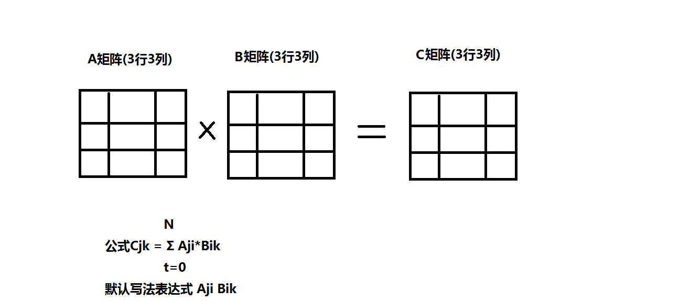
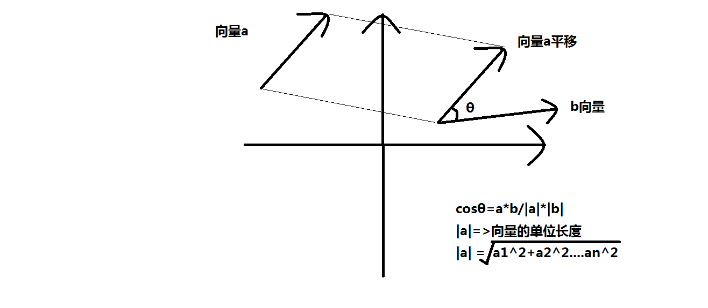
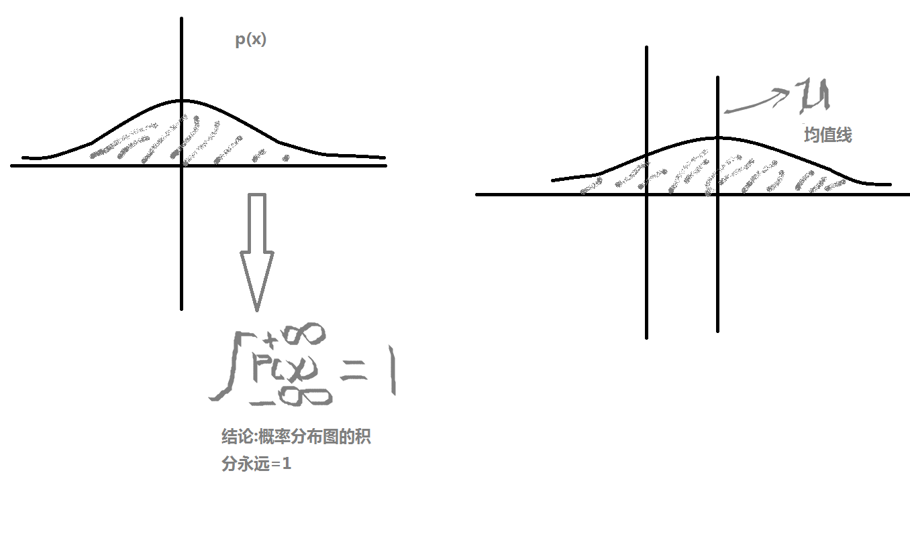

# 1. 函数

  ## 1.1 一维函数求导

   ##### ${f(x)}=x^2$
   ##### ${f'(x)}=2x$
****
  ## 1.2 多维函数 定义重点看
   ##### ${f(x,y)} = {x^2} + {y^2}$
   ##### $f'(x) = qf/qx = 2x$  ---  __对x的求导,定义y=c即y=0__
   _*反之*_
   ##### _f'(y) = qf/qy = 2y_  ---  __对y的求导,定义x=c即x=0__
   ### **链式求导 重点看法则**
   ### **区别:y=x^2(等式) && 函数定义 $f(x) = x^2$**
   ##### ${f'(y)} = 2y$
   $\frac{df}{dx}=\frac{df}{dy}*\frac{dy}{dx}$
****
  ## 1.3 原函数
   ##### **$f(x) = x^2 + c$ 求导之前的函数(原函数)**
   ##### **f'(x) = 2x 求导之后的结果是2x**
   ##### **结论:f'(x)是对f(x)的函数求导,结果是2x)**
****
  ## 1.4 积分(不重要)
   **${∫f'(x)} = {x^2} + c$ 这是原函数f(x),也是对f'(x)的导函数的积分**
   **结论:积分和求导函数互为反函数,即原函数$f(x)=∫f'(x)=x^2+c$**
   **ps:机器学习积分使用比较少,主要知识点还在导数**
****
# 2. 向量(矩阵)
  ## 2.1 函数下标
  ##### $a_{ij}$ 这里ij是a的下标字符
  ## 2.2 求和符号
  ### $\sum_{i=1}^{N}$  ==>  **对ai求和 即:$a_1$\+$a_2$\+.......\+$a_N$**
****
  ## 2.3 连乘符号
  #### $\prod_{i=1}^{N}{a_i}$   ==>  **对ai求积 即:$a_1$\*$a_2$\*.......\*$a_N$**
****
  ## 2.4 向量概念
  $$
  V=\left[
  \begin{matrix}
  v_1&v_2&v_3&\cdots&v_n\\
  \end{matrix}
  \right]^T
  $$
  #### ==>  相当于以下的矩阵
  $$
  V=\left[
  \begin{matrix}
  v_1&\\v_2&\\v_3&\\\vdots&\\v_n
  \end{matrix}
  \right]
  $$
  **结论:n维向量的表达,第一个式子上的T是反转符号,反转之后即为第二个式子**
****
  ## 2.5 矩阵概念
  $$
  A_{mn}=
	\begin{pmatrix}
	a_11&a_12&a_13&\cdots&a_1n\\
	1&a_2&a_2^2&\cdots&a_2^n\\
	\vdots&\vdots&\vdots&\ddots&\vdots\\
	1&a_m&a_m^2&\cdots&a_m^n\\
	\end{pmatrix}
	$$
  **代表m*n个的有序集合,**
  **下标有2个代表是二维矩阵**
****
  ## 2.6 矩阵的几种表达式子
   #### 1. A
   #### 2. $A_=$
   #### 3. $[A_{ij}]$
****
# 3. 矩阵向量相关运算
  ## 3.1 向量相乘
   #### **$ab = \sum{a_i}{b_i}$ ==> 书写方式**
   #### **向量相乘 ==> <a,b> 每个元素相乘之后再求和**
   
   ****
  ## 3.2 向量的夹角(机器学习中的相似度定义)
   #### **公式图见附图(向量的夹角)**
   
   ****
  ## 3.3 矩阵的相乘 (线代)
   #### **$A_{pq}*B_{qr} = C_{pr}$**
****
# 4. 概率  
  ## 4.1 定义:某件事情发生的概率
   #### **连续概率分布**
   
   #### **高斯分布公式**
   $$
   p(x)=
   \frac{1}{σ\sqrt{2π}}^{e^-\frac{{x-μ}^2}{2σ^2}}
   $$
  ## 4.2 条件概率
   #### 举个栗子说明
   #### **已知 p(x|A)**
   #### **已知A条件下,推测X发生的概率**
****
  **例:诸葛亮借东风:晚上有大雾,白天有大风**
   #### **满足条件A:晚上有大雾,白天有大风**
   #### **因此推测有X的概率会有东风**
